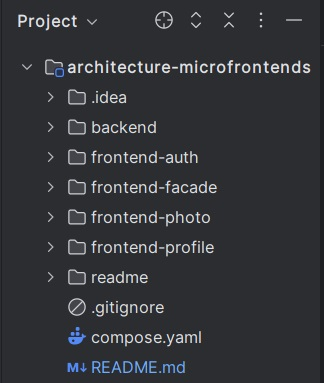
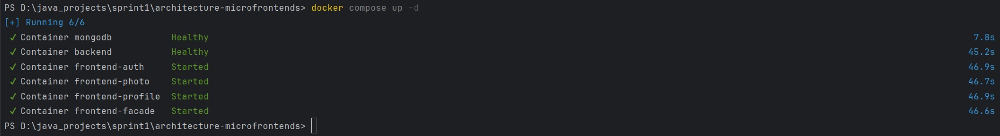
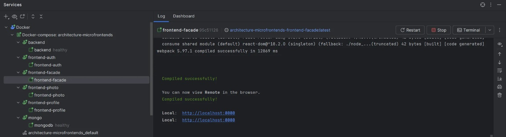
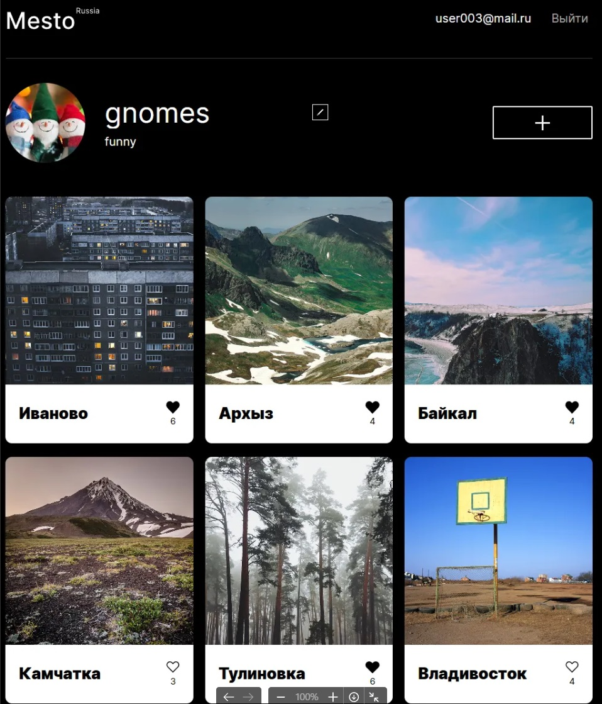
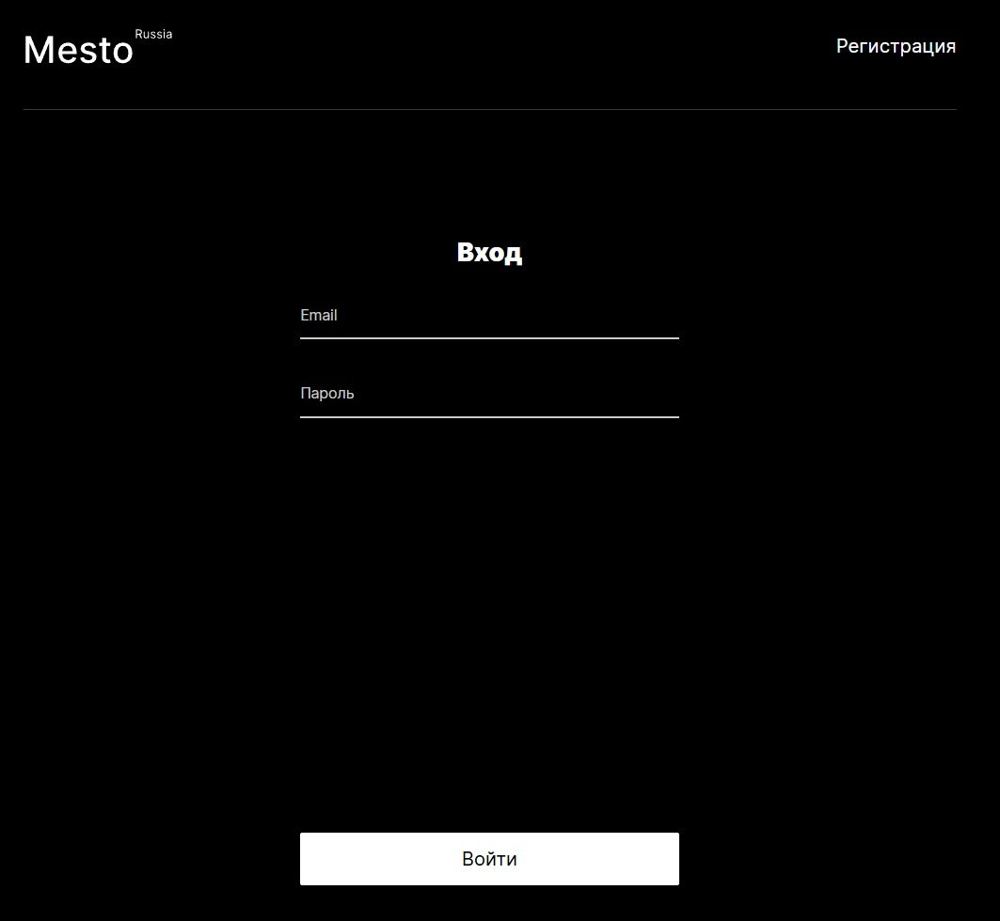
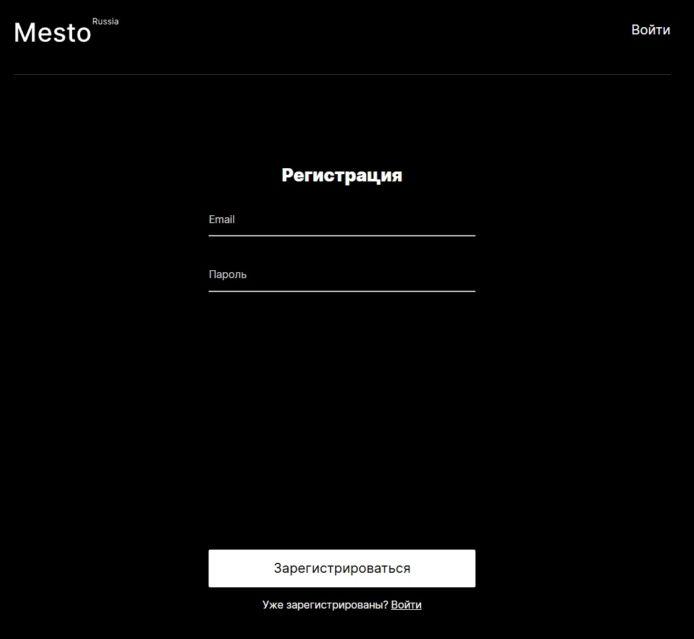

## Микрофронтенды 

### Описание проекта
Монолитный фронтенд разделен на отдельные независимые проекты со следующими функциональностями:     
-авторизация (аутентификация и регистрация)    
-профиль пользователя (создание и редактирование)   
-работа с контентом (загрузка, удаление фотографий, учет лайков)   
-фасад (композиция микрофронтендов)     

Микрофронтенды взаимодействуют между собой по паттерну Module Federation: https://webpack.js.org/concepts/module-federation/

Разбиение фронтенда на микрофронтенды по аналогии с микросервисами для бекенда позволяет разрабатывать, тестировать и развертывать приложения 
независимо друг от друга с использованием различных технологий. Каждый микрофронтенд отвечает за отдельную предметную область.

Переход от монолита к микрофронтендам осуществлялся по паттерну Strangler Fig, каждая отдельная функциональность выделялась в 
микрофронтенд одновременно с работой монолитного приложения, что в итоге позволило его полностью заменить и удалить из проекта.     

Структура проекта:     
  

Отдельный микрофронтенд создан через npx create-mf-app как React проект.    

Как запустить проект?   
Выполнить docker compose up -d в терминале из папки с файлом compose.yml    
     
или через IDE docker plugin  
     

Приложение доступно на 8080 порту.

Общий вид объединенных микрофронтендов:  
   
   
   

### Использованные технологии   
-JavaScript     
-Node.js    
-React  
-MongoDB, CompassGUI   
-Docker     
-Intellij Idea  
